1. [Create video main task](#create-video-main-task)
2. [Create video sub-task](#create-video-sub-task)

### Create video main task
| Step | Example |
| --- | --- |
| Go to `Issues` tab. | 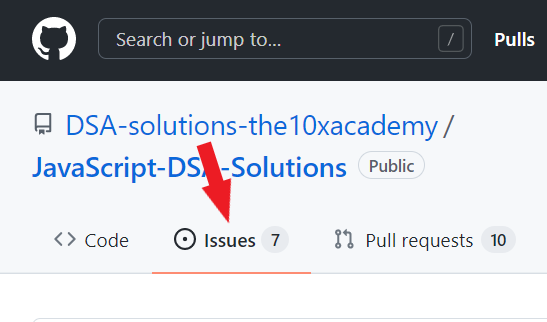 |
| Click on `New issue`. | 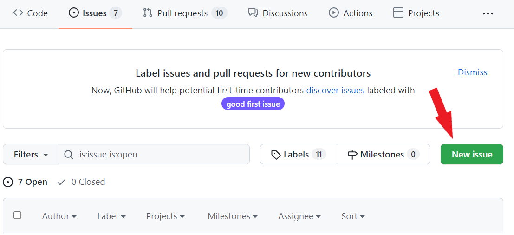 |
| Use the template named `Solution video task` (click on `Get started`). | 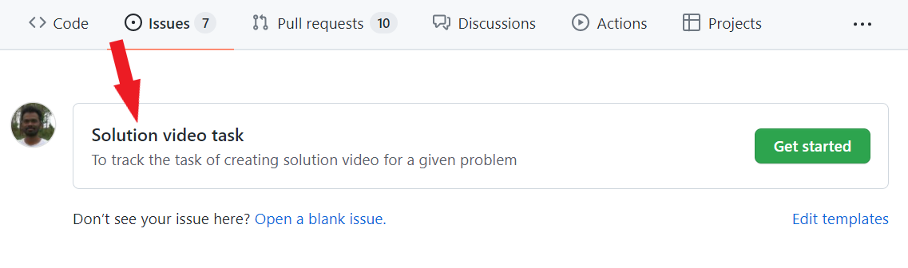 |
| Fill the `<topic-name>` and `<problem-name>`. | 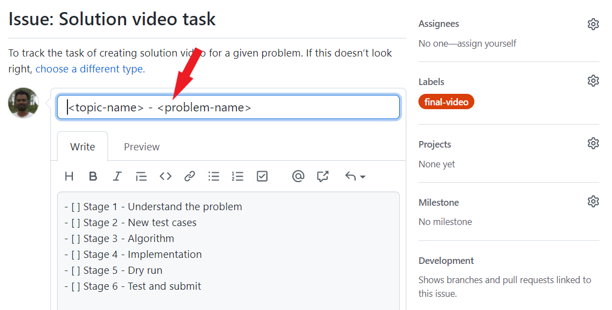 |
| Example | 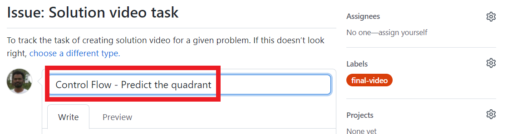 |
| Click on `Submit new issue`. This will create the issue. | 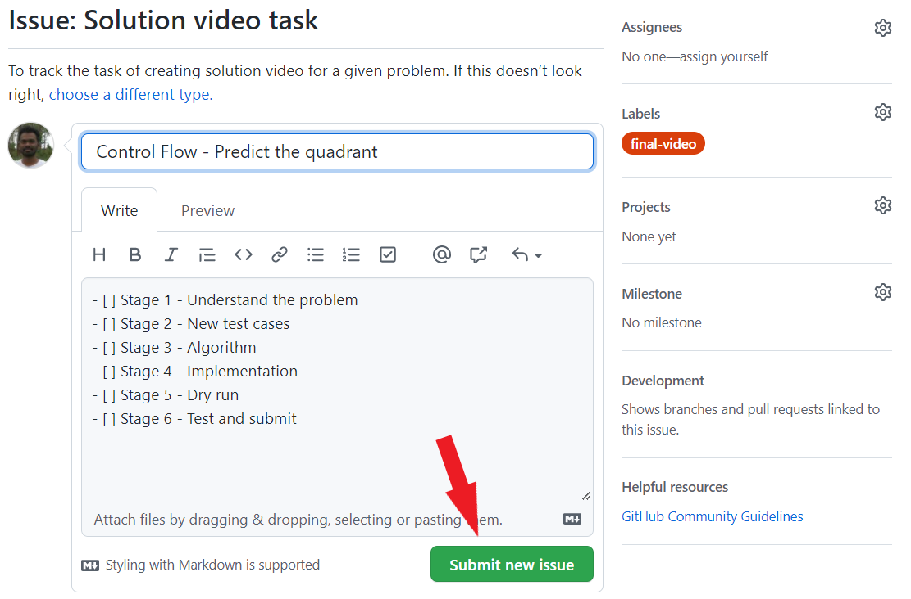 |

---

### Create video sub-task
| Step | Example |
| --- | --- |
| Hover over `Stage 1` line. You will see a `Convert to issue button`. Click on it. | 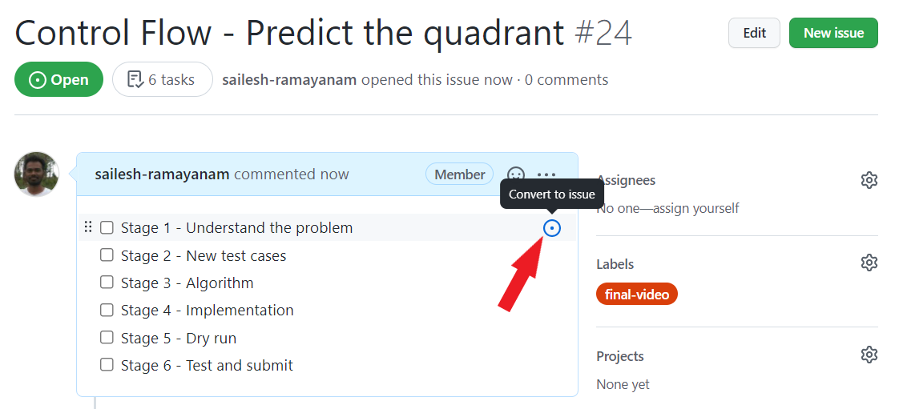 |
| A new issue will be created and `Stage 1` will be automatically linked to it. | 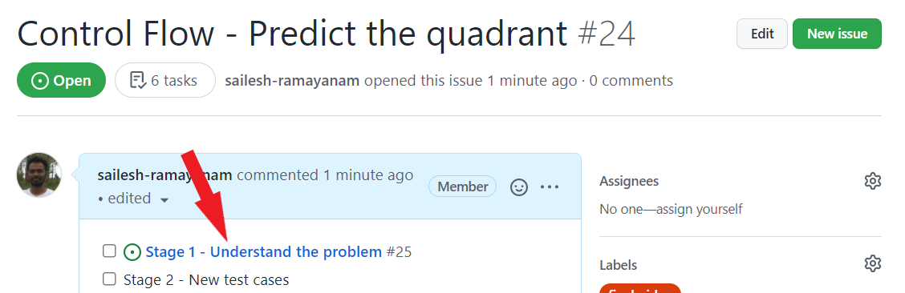 |
| If you click on the `Stage 1` link from above, it will open the newly created sub-task. | 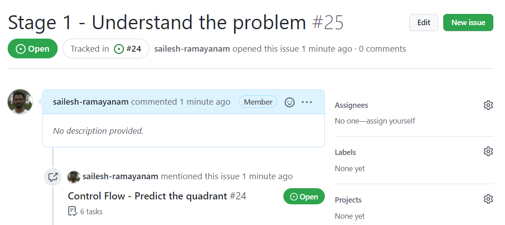 |
| Add the label `stage-wise-video`. | 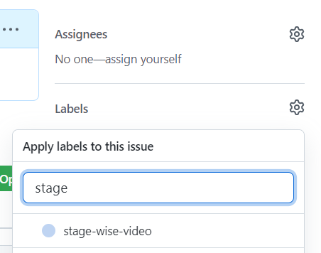 |
| Add an assignee. Assignee is the mentor who will create the `Stage 1` video. | 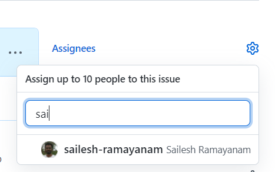 |
| **Repeat the above steps for the remaining stages. For every main task, you must create 6 sub-tasks, one for each stage.** | |
